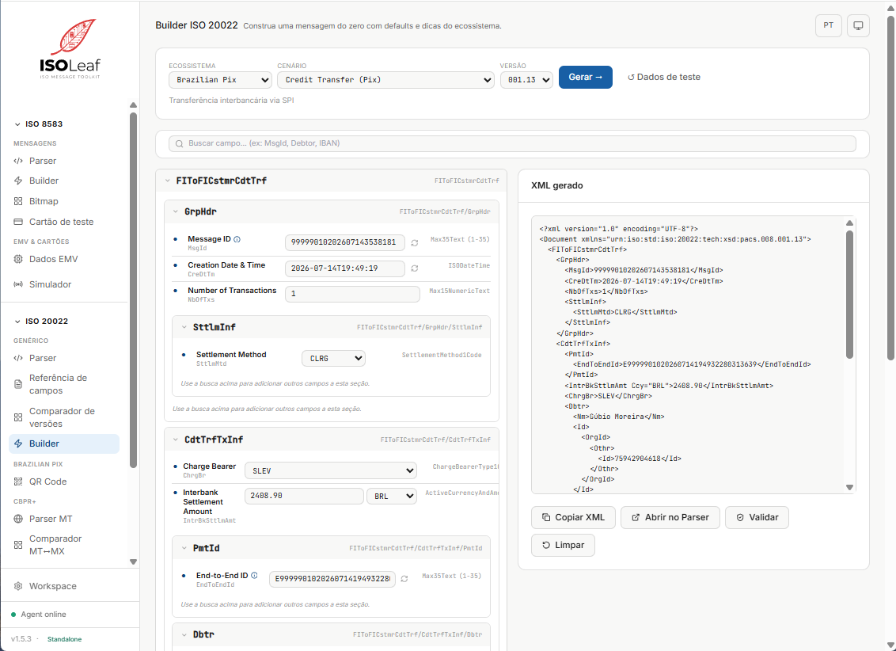
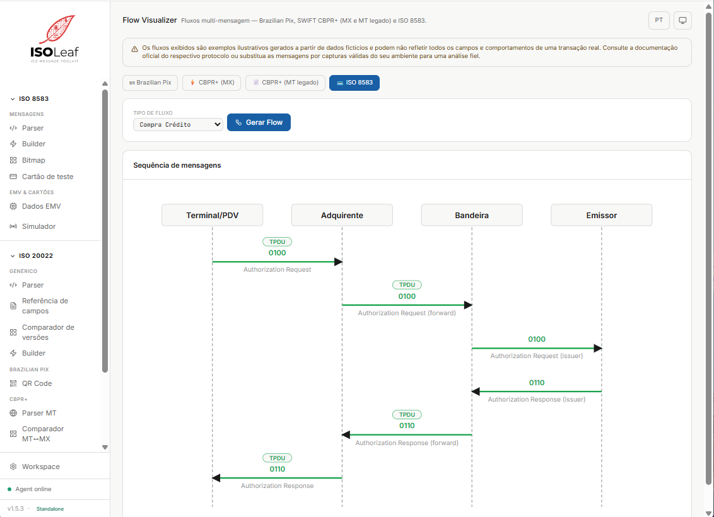
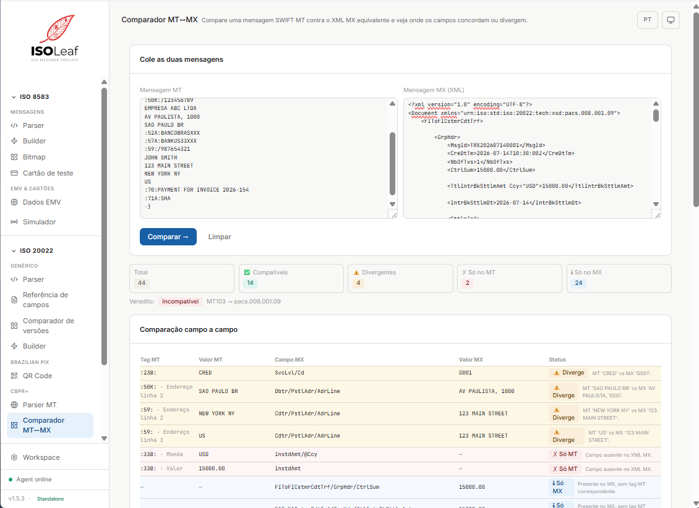

# ISOLeaf — ISO 8583 & ISO 20022 Toolkit

> Parse, build, simulate and debug ISO 8583 and ISO 20022 messages — all in one place.

[](./LICENSE)
[](https://dotnet.microsoft.com)
[](https://react.dev)
[](https://ghcr.io/isoleaf-io/isoleaf)

---

## What is ISOLeaf?

ISOLeaf is a standalone developer toolkit for engineers working with card-network
payment protocols (ISO 8583) and financial-messaging XML protocols (ISO 20022 —
covering Brazilian Pix, SWIFT CBPR+, SEPA and TARGET/T2). It runs entirely on
your machine — no cloud, no sign-up, no data leaves your environment.

### ISO 8583 Modules

| Module | Description |
|--------|-------------|
| **Parser** | Decode ISO 8583 messages — ASCII wire, binary-hex, with or without TPDU |
| **Builder** | Generate complete ISO 8583 messages by transaction context (role, brand, channel) |
| **Bitmap** | Interactively decode and construct bitmaps |
| **EMV / Cryptography** | Parse Bit 55 TLV, validate ARQC, generate ARPC, run Full EMV Flow |
| **TCP Simulator** | Listen and auto-respond (rebatedor) or connect and inject (injector) |
| **Test Card Generator** | Generate valid test PANs, tracks and CVV by brand |
| **Workspace** | Local key management — configure IMK/ZPK for real ARQC generation |

### ISO 20022 Modules

| Module | Description |
|--------|-------------|
| **XML Parser** | Decode any ISO 20022 message — auto-detects family and version by namespace |
| **Field Reference** | Browse the XSD tree per message and cross-search fields across every family and version |
| **XSD Validator + Version Comparator** | Validate against the schema and diff two versions of the same type |
| **Builder (5 ecosystems)** | Generate messages for Brazilian Pix, SEPA, SWIFT CBPR+, TARGET/T2 or Generic |
| **Pix QR Code** | Decode and generate Pix Copia-e-Cola payloads (EMV-MPM) with CRC-16 validation |
| **Flow Visualizer** | Cross-protocol sequence diagram — Pix, CBPR+ MX/MT and ISO 8583 |
| **MT Parser** | Parse legacy SWIFT MT103 / MT202 / MT202COV messages block by block |
| **MT ↔ MX Comparator** | Convert MT into pacs.008/pacs.009 and diff field by field with confidence levels |
| **Workspace Schemas** | Upload custom XSDs — SchemaRegistry reloads live, no restart |

---

## Screenshots

### Parser


### Builder


### Simulator


### EMV Data


### ISO 20022 Builder


### Cross-Protocol Flow Visualizer


### MT ↔ MX Comparator


---

## Quick Start

### Option 1 — Docker (recommended)

```bash
docker run -p 8080:8080 ghcr.io/isoleaf-io/isoleaf:latest
```

Open [http://localhost:8080](http://localhost:8080)

> Add `-p 9100:9100 -p 8583:8583` (or any port you plan to use) to expose the
> Simulator's TCP listeners from inside the container.

### Option 2 — Docker Compose

```bash
git clone https://github.com/isoleaf-io/isoleaf.git
cd isoleaf
docker compose -f docker-compose.standalone.yml up
```

The compose file already exposes ports `8080`, `9100`, `9200` and `8583`,
mounts a `isoleaf-data` volume at `/app/data`, and runs the container with a
`/api/health` healthcheck.

> **Persisting uploaded ISO 20022 schemas.** If you plan to upload custom XSDs
> via **Workspace → ISO 20022 Schemas** and want them to survive image
> updates, add `-v isoleaf-schemas:/app/data/schemas` to the `docker run`
> command (or the equivalent volume entry in your compose override).

### Option 3 — Build from source

**Requirements:**
- [.NET 9 SDK](https://dotnet.microsoft.com/download)
- [Node.js 20+](https://nodejs.org)

```bash
git clone https://github.com/isoleaf-io/isoleaf.git
cd isoleaf

# Build frontend
cd frontend/isohub
npm install
npm run build

# Run the Agent (serves frontend + API on :8080)
cd ../../agent/Iso8583Toolkit.Agent
dotnet run
```

Open [http://localhost:8080](http://localhost:8080)

---

## API

ISOLeaf exposes a REST API for integration with automated test tools
and data generation pipelines. Available in self-hosted (Docker) mode only.

Interactive documentation (Scalar UI):
http://localhost:8080/api/docs

### Key endpoints

| Endpoint | Description |
|---|---|
| `POST /api/parse/hex` | Parse an ISO 8583 message from hex, ASCII-wire or binary-hex |
| `POST /api/emv/parse-bit55` | Parse BER-TLV EMV data from Bit 55 |
| `POST /api/cards/generate` | Generate a synthetic Luhn-valid test card |
| `POST /api/emv/generate-arqc` | Compute the ARQC cryptogram |
| `POST /api/emv/generate-arpc` | Compute the ARPC (issuer response cryptogram) |
| `POST /api/iso20022/builder/build` | Generate an ISO 20022 message from an ecosystem + scenario cascade |
| `GET  /api/test-data/person` | Return a fake person fixture (name, CPF, e-mail, Pix phone) |
| `POST /api/iso20022/validate` | Validate an ISO 20022 XML against its embedded XSD |
| `POST /api/swift/mt/parse` | Parse a SWIFT MT103 / MT202 / MT202COV message |
| `POST /api/pix/qrcode/generate` | Generate a Pix Copia-e-Cola payload (EMV-MPM with CRC-16) |

### Quick example

```bash
# Parse an ISO 8583 message
curl -X POST http://localhost:8080/api/parse/hex \
  -H "Content-Type: application/json" \
  -d '{"hex": "0100723800000000000000000000"}'

# Generate a test card
curl -X POST http://localhost:8080/api/cards/generate \
  -H "Content-Type: application/json" \
  -d '{"brand": "Visa"}'
```

> ⚠️ Do not send real cardholder data or production keys to external
> servers. Run ISOLeaf locally for sensitive operations.

---

## Features

### Parser
- Auto-detects ASCII wire, binary-hex, and TPDU prefix
- Displays all decoded fields with masking for sensitive data (PAN, PIN Block)
- One-click navigation to Builder, Bitmap, or EMV modules
- Export parsed result as JSON

### Builder
- Smart generation by role (Acquirer, Network, Issuer), brand, channel, and transaction type
- Real ARQC cryptogram when IMK is configured in Workspace
- Persistent templates via localStorage
- One-click reversal (generates 0400 with Bit 90 populated)

### EMV Cryptography
- Parse Bit 55 BER-TLV with partial parse support (no 400 errors on truncated data)
- Proprietary header skip (configurable byte offset)
- Validate ARQC against Issuer Master Key
- Generate ARPC (Method 1 and 2)
- Build Bit 55 response (tags 91 + 8A)
- Full EMV Flow: validate → generate ARPC → build response in one step
- Supports Visa CVN 10/18, Mastercard M/Chip, Elo profiles

### TCP Simulator
- **Rebatedor**: listens on a TCP port and auto-responds to incoming messages
- **Injector**: connects to an external system and sends messages
  - Single injection or continuous mode (1 msg/s, low load)
  - Vary identifiers (STAN, DateTime, RRN) per send
  - Vary transaction amount within a configured range
- Unknown MTI policy: Derive automatically, Reject, Echo, or Custom MTI
- TPDU mode: Optional, Required, Strip, or Auto
- Live log with per-session filtering

### ISO 20022
- **Multi-Ecosystem Builder** — five ready-made ecosystems with regulator-compliant defaults:
  - **Brazilian Pix** (SPI/BCB) — 32-char EndToEndId, ISPB, TxId per BCB Standards Manual
  - **SEPA** — IBAN, euro-area purpose codes and cardinalities
  - **SWIFT CBPR+** — BIC + UETR, cover payments (pacs.009), Debtor/Creditor agents
  - **TARGET/T2** — Eurosystem RTGS variant
  - **Generic** — any loaded XSD (including custom uploads from Workspace)
- **Cross-Protocol Flow Visualizer** — sequence diagrams for Pix (PSP → SPI → PSP), SWIFT CBPR+ (MX and legacy MT) and ISO 8583; each arrow opens the real message payload with a parse summary
- **MT ↔ MX Parser & Comparator** — parse MT103/MT202/MT202COV, convert to pacs.008/pacs.009 via BuilderService, diff MT vs MX field by field with `Automatic`/`Ambiguous`/`NoMapping` confidence per field
- **Reference & Validator** — browse the XSD tree per message, cross-search field names across 44+ shipped schemas, validate any XML against the schema with line/column-anchored errors
- **Pix QR Code** — decode and generate Copia-e-Cola (EMV-MPM) payloads, static or dynamic, with CRC-16 and DICT key detection

> Deep-dive documentation at [docs.isoleaf.dev](https://docs.isoleaf.dev) — including every ISO 20022 family (camt/pacs/pain/head), the AppHdr / Document envelope model, the 5 ecosystems' business rules, and step-by-step guides for the Builder, Flow Visualizer and MT↔MX Comparator.

---

## Architecture

```
isoleaf/
├── src/
│   ├── Iso8583Toolkit.IsoCore/        # ISO 8583 parsing and building
│   ├── Iso8583Toolkit.Cards/          # Card generation (PAN, tracks, CVV)
│   ├── Iso8583Toolkit.Cryptography/   # EMV cryptography (ARQC, ARPC, TLV)
│   ├── Iso8583Toolkit.Iso20022/       # ISO 20022 parsing, building, reference and validation
│   └── Iso8583Toolkit.Simulator/      # TCP session management
├── agent/
│   └── Iso8583Toolkit.Agent/          # ASP.NET Core host + REST API + SignalR
├── frontend/
│   └── isohub/                         # React + TypeScript + Vite + Tailwind
└── tests/
    ├── Iso8583Toolkit.IsoCore.Tests/
    ├── Iso8583Toolkit.Cards.Tests/
    ├── Iso8583Toolkit.Integration.Tests/
    └── Iso8583Toolkit.Agent.Tests/
```

---

## Running Tests

```bash
# All backend tests
dotnet test

# Frontend tests
cd frontend/isohub
npm run test
```

---

## Configuration

ISOLeaf stores configuration locally. No external services required.

### Workspace

Configure default values for:
- **Issuer Master Key (IMK)** — used for real ARQC generation in the Builder
- **Zone PIN Key (ZPK)** — used for PIN Block derivation
- **Terminal ID, Merchant ID, NIIs** — used as defaults in generated messages

### Simulator Sessions

Sessions are stored in memory and reset on restart. All TCP traffic stays local.

---

## Supported Brands

| Brand | BIN Detection | ARQC Profile | Track Generation |
|-------|--------------|--------------|-----------------|
| Visa | ✅ | CVN 10 / CVN 18 | ✅ |
| Mastercard | ✅ | M/Chip | ✅ |
| Elo | ✅ | Elo | ✅ |
| Amex | ✅ | — | ✅ |
| Hipercard | ✅ | — | ✅ |
| Generic (ISO 8583) | — | — | ✅ |

---

## Language Support

ISOLeaf supports **Portuguese (pt-BR)** and **English (en)**.
Toggle via the language button in the top-right corner.

---

## Community & Support

- 💬 **Discussions**: [github.com/isoleaf-io/isoleaf/discussions](https://github.com/isoleaf-io/isoleaf/discussions)
  — Questions, ideas and show & tell
- 🐛 **Issues**: [github.com/isoleaf-io/isoleaf/issues](https://github.com/isoleaf-io/isoleaf/issues)
  — Bug reports and feature requests
- 📧 **Email**: contato@isoleaf.dev
  — Direct contact for partnerships and enterprise inquiries
- 🔒 **Security**: [SECURITY.md](./SECURITY.md)
  — Report vulnerabilities responsibly

---

## Contributing

See [CONTRIBUTING.md](./CONTRIBUTING.md) for guidelines on reporting bugs,
suggesting features, and submitting pull requests.

---

## License

ISOLeaf is licensed under the [Elastic License 2.0](./LICENSE).

- ✅ Free for personal and internal commercial use
- ✅ Modify and distribute for internal use
- ❌ Cannot be offered as a hosted/managed service to third parties

---

## Roadmap

- [ ] EMV tag decoders (TVR, AIP, TTQ, CVM List, IAD by brand)
- [ ] Key Block decoder (ANSI TR-31)
- [ ] ISO 20022 Simulator (Sprint 11)
- [ ] Custom MTI response map in Simulator UI
- [ ] ISO 8583:2003 layout support

---

*Built for payment engineers, by payment engineers.*
