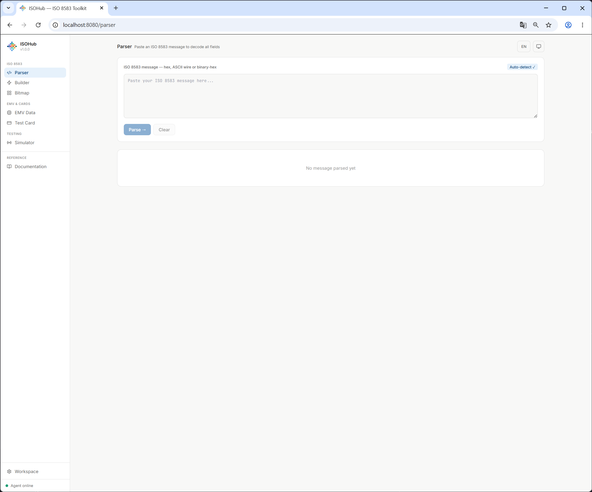
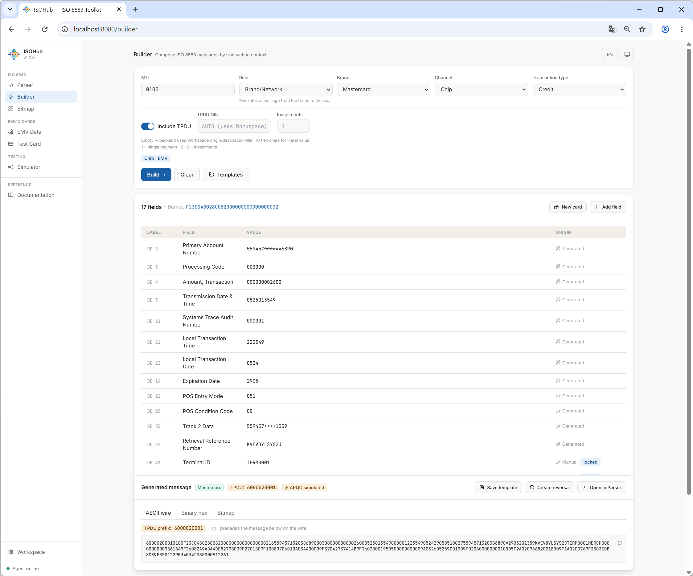
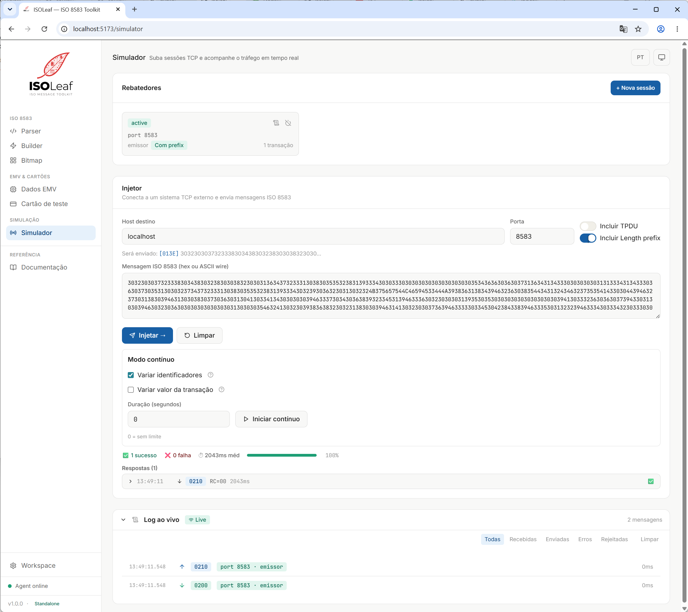
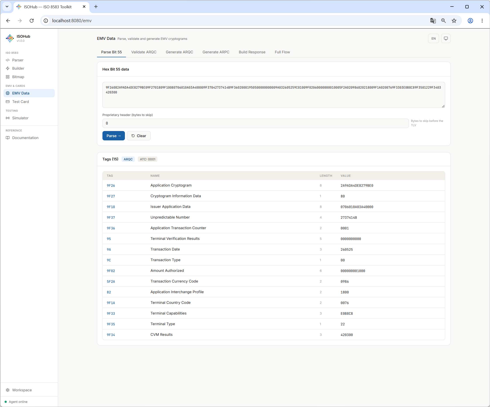

# ISOHub — ISO 8583 Toolkit

> Parse, build, simulate and debug ISO 8583 messages — all in one place.

[](./LICENSE)
[](https://dotnet.microsoft.com)
[](https://react.dev)
[](https://ghcr.io/isohub-io/isohub)

---

## What is ISOHub?

ISOHub is a standalone developer toolkit for engineers working with ISO 8583
payment protocols. It runs entirely on your machine — no cloud, no sign-up,
no data leaves your environment.

### Modules

| Module | Description |
|--------|-------------|
| **Parser** | Decode ISO 8583 messages — ASCII wire, binary-hex, with or without TPDU |
| **Builder** | Generate complete ISO 8583 messages by transaction context (role, brand, channel) |
| **Bitmap** | Interactively decode and construct bitmaps |
| **EMV / Cryptography** | Parse Bit 55 TLV, validate ARQC, generate ARPC, run Full EMV Flow |
| **TCP Simulator** | Listen and auto-respond (rebatedor) or connect and inject (injector) |
| **Test Card Generator** | Generate valid test PANs, tracks and CVV by brand |
| **Workspace** | Local key management — configure IMK/ZPK for real ARQC generation |

---

## Screenshots

### Parser


### Builder


### Simulator


### EMV Data


---

## Quick Start

### Option 1 — Docker (recommended)

```bash
docker run -p 8080:8080 ghcr.io/isohub-io/isohub:latest
```

Open [http://localhost:8080](http://localhost:8080)

> Add `-p 9100:9100 -p 8583:8583` (or any port you plan to use) to expose the
> Simulator's TCP listeners from inside the container.

### Option 2 — Docker Compose

```bash
git clone https://github.com/isohub-io/isohub.git
cd isohub
docker compose -f docker-compose.standalone.yml up
```

The compose file already exposes ports `8080`, `9100`, `9200` and `8583`,
mounts a `isohub-data` volume at `/app/data`, and runs the container with a
`/api/health` healthcheck.

### Option 3 — Build from source

**Requirements:**
- [.NET 9 SDK](https://dotnet.microsoft.com/download)
- [Node.js 20+](https://nodejs.org)

```bash
git clone https://github.com/isohub-io/isohub.git
cd isohub

# Build frontend
cd frontend/isohub
npm install
npm run build

# Run the Agent (serves frontend + API on :8080)
cd ../../agent/Iso8583Toolkit.Agent
dotnet run
```

Open [http://localhost:8080](http://localhost:8080)

---

## Features

### Parser
- Auto-detects ASCII wire, binary-hex, and TPDU prefix
- Displays all decoded fields with masking for sensitive data (PAN, PIN Block)
- One-click navigation to Builder, Bitmap, or EMV modules
- Export parsed result as JSON

### Builder
- Smart generation by role (Acquirer, Network, Issuer), brand, channel, and transaction type
- Real ARQC cryptogram when IMK is configured in Workspace
- Persistent templates via localStorage
- One-click reversal (generates 0400 with Bit 90 populated)

### EMV Cryptography
- Parse Bit 55 BER-TLV with partial parse support (no 400 errors on truncated data)
- Proprietary header skip (configurable byte offset)
- Validate ARQC against Issuer Master Key
- Generate ARPC (Method 1 and 2)
- Build Bit 55 response (tags 91 + 8A)
- Full EMV Flow: validate → generate ARPC → build response in one step
- Supports Visa CVN 10/18, Mastercard M/Chip, Elo profiles

### TCP Simulator
- **Rebatedor**: listens on a TCP port and auto-responds to incoming messages
- **Injector**: connects to an external system and sends messages
  - Single injection or continuous mode (1 msg/s, low load)
  - Vary identifiers (STAN, DateTime, RRN) per send
  - Vary transaction amount within a configured range
- Unknown MTI policy: Derive automatically, Reject, Echo, or Custom MTI
- TPDU mode: Optional, Required, Strip, or Auto
- Live log with per-session filtering

---

## Architecture

```
isohub/
├── src/
│   ├── Iso8583Toolkit.IsoCore/        # ISO 8583 parsing and building
│   ├── Iso8583Toolkit.Cards/          # Card generation (PAN, tracks, CVV)
│   ├── Iso8583Toolkit.Cryptography/   # EMV cryptography (ARQC, ARPC, TLV)
│   └── Iso8583Toolkit.Simulator/      # TCP session management
├── agent/
│   └── Iso8583Toolkit.Agent/          # ASP.NET Core host + REST API + SignalR
├── frontend/
│   └── isohub/                        # React + TypeScript + Vite + Tailwind
└── tests/
    ├── Iso8583Toolkit.IsoCore.Tests/
    ├── Iso8583Toolkit.Cards.Tests/
    ├── Iso8583Toolkit.Integration.Tests/
    └── Iso8583Toolkit.Agent.Tests/
```

---

## Running Tests

```bash
# All backend tests
dotnet test

# Frontend tests
cd frontend/isohub
npm run test
```

Current test count: **487 tests, 0 failures**

---

## Configuration

ISOHub stores configuration locally. No external services required.

### Workspace

Configure default values for:
- **Issuer Master Key (IMK)** — used for real ARQC generation in the Builder
- **Zone PIN Key (ZPK)** — used for PIN Block derivation
- **Terminal ID, Merchant ID, NIIs** — used as defaults in generated messages

### Simulator Sessions

Sessions are stored in memory and reset on restart. All TCP traffic stays local.

---

## Supported Brands

| Brand | BIN Detection | ARQC Profile | Track Generation |
|-------|--------------|--------------|-----------------|
| Visa | ✅ | CVN 10 / CVN 18 | ✅ |
| Mastercard | ✅ | M/Chip | ✅ |
| Elo | ✅ | Elo | ✅ |
| Amex | ✅ | — | ✅ |
| Hipercard | ✅ | — | ✅ |
| Generic (ISO 8583) | — | — | ✅ |

---

## Language Support

ISOHub supports **Portuguese (pt-BR)** and **English (en)**.
Toggle via the language button in the top-right corner.

---

## Contributing

See [CONTRIBUTING.md](./CONTRIBUTING.md) for guidelines on reporting bugs,
suggesting features, and submitting pull requests.

---

## License

ISOHub is licensed under the [Elastic License 2.0](./LICENSE).

- ✅ Free for personal and internal commercial use
- ✅ Modify and distribute for internal use
- ❌ Cannot be offered as a hosted/managed service to third parties

---

## Roadmap

- [ ] EMV tag decoders (TVR, AIP, TTQ, CVM List, IAD by brand)
- [ ] Key Block decoder (ANSI TR-31)
- [ ] ISOHub Online (hosted, no sign-up required)
- [ ] Custom MTI response map in Simulator UI
- [ ] ISO 8583:2003 layout support

---

*Built for payment engineers, by payment engineers.*
